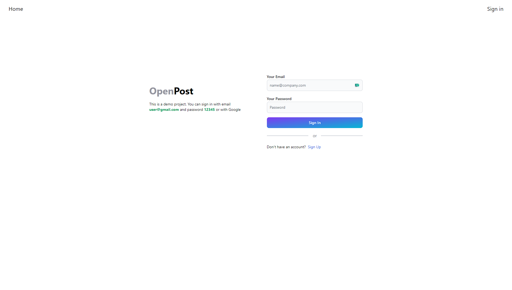
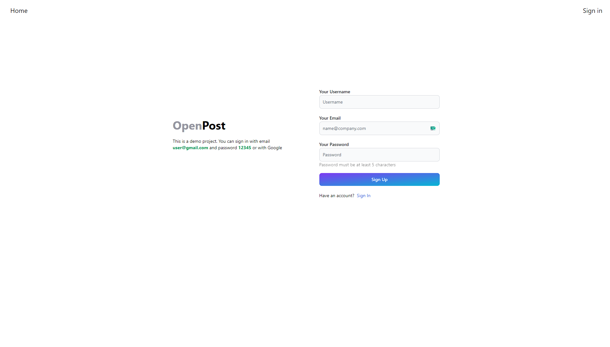
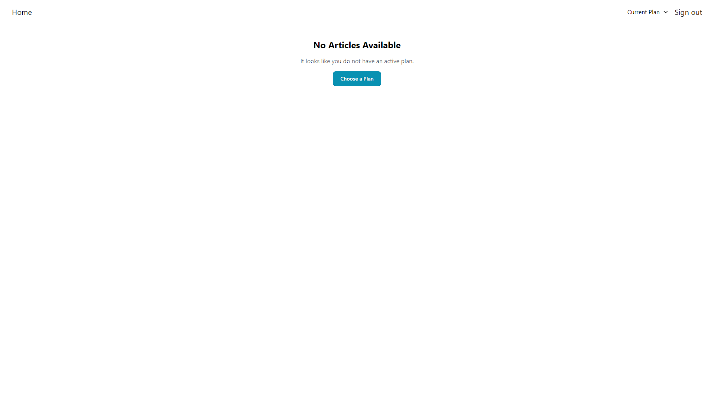
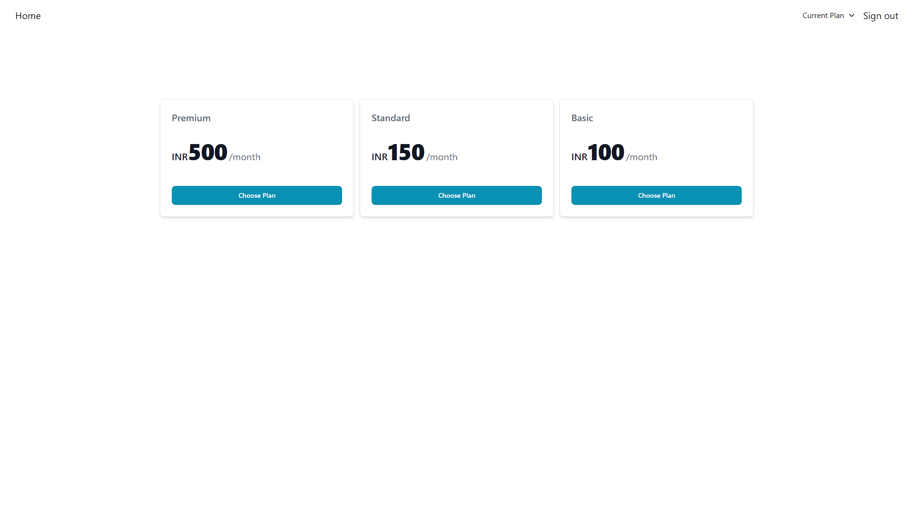
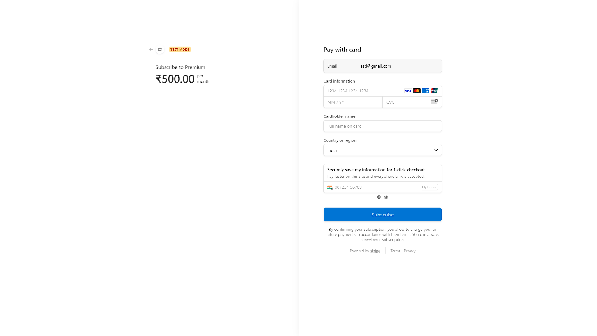
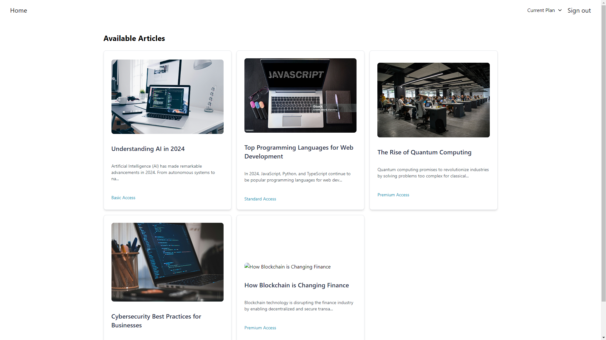
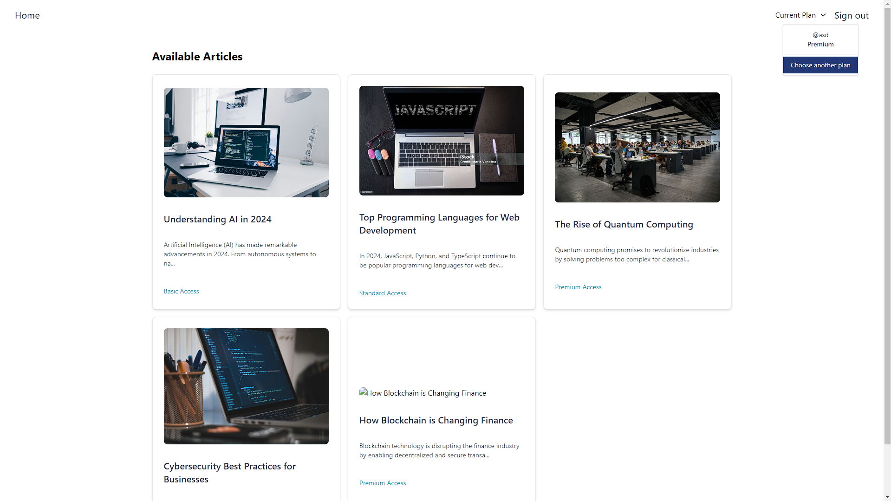
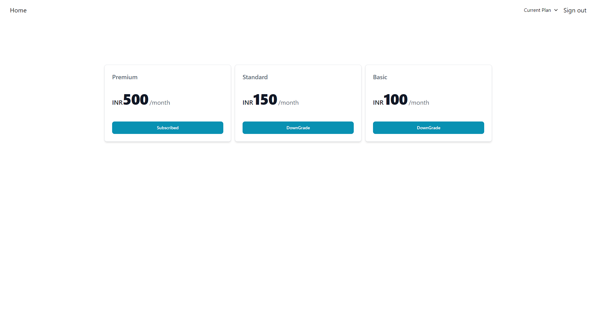

# Project Setup and Running Instructions

## 1. Rename `sample.env` to `.env`
### server/sample.env
To configure the environment variables for the project, you need to rename the `sample.env` file to `.env`. This file contains environment-specific settings that are necessary for running the project.


## 2. Clone the Repository

First, clone the repository to your local machine. Run the following command in your terminal:

```bash
git clone https://github.com/Karansiddiqui/Subscription-Web-App.git

```

## 3.  Set Up and Run the Project

### 1. Set Up the Client
open terminal
``` bash
cd .\client\    

npm install

npm run dev

```
### 2. Set Up the Server
open terminal
``` bash
cd .\server\

npm install

npm run dev

```

## Screenshots








